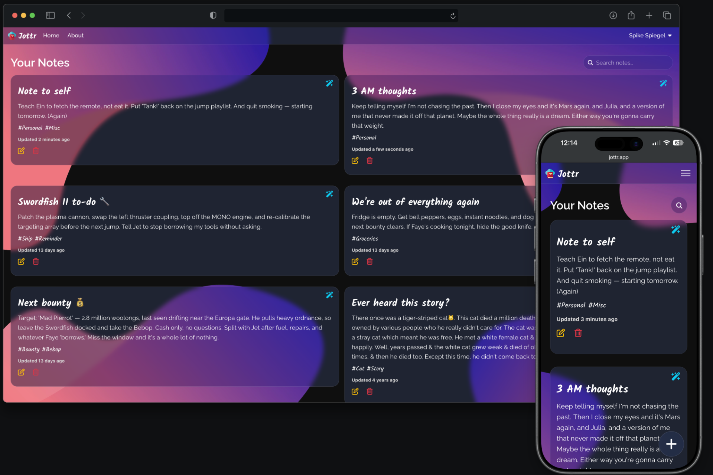

<h1 align="center">Jottr</h1>

<p align="center">AI-powered notes — capture anything, and summarize it on demand.</p>

<p align="center">
  <a href="https://jottr.app"><strong>jottr.app »</strong></a>
</p>

<p align="center">
  
  
  
  
  
</p>

[](https://app.netlify.com/projects/jottr-app/deploys)

---

## Overview

Jottr is an open-source, cross-platform note app that helps you capture thoughts, reminders, loose ideas etc and get AI-written summary on demand.

<p align="center">
  
</p>

## Tech stack

**Frontend** — Vite · React · React Router · TanStack Query · Zustand · Tailwind CSS · Radix UI

**Backend** — Node · Express · Mongoose (MongoDB) · JSON Web Tokens · bcrypt · Helmet · express-rate-limit · express-validator

**AI** — Anthropic Claude (Haiku 4.5)

**Testing** — Vitest · React Testing Library · jsdom (36 tests, ~89% line coverage)

**Hosting** — Netlify (client) · Google Cloud Run (API) · MongoDB Atlas (data)

## Architecture

```
client/                          server/
  React SPA (Vite)                 Express REST API
  ├─ TanStack Query  ──HTTP──►     ├─ routes/       (auth, notes)
  │   optimistic cache             ├─ middleware/   (JWT verify)
  ├─ Zustand  (alerts, modals)     ├─ models/       (Mongoose schemas)
  └─ Radix + Tailwind UI           └─ lib/          (AI summary, quota, validation)
                                        │
                                   MongoDB
```

## Typical workflow

1. **Sign up / log in** — a JWT is issued and stored client-side.
2. **Write a note** — added optimistically, persisted to MongoDB Atlas.
3. **Summarize** — `POST /api/notes/summarize/:id` runs rate-limit → JWT auth → ownership check → daily quota → the AI model, and returns the summary.
4. **Edit or delete** — both optimistic; delete holds a 10-second undo before it commits.

## Getting started

### Prerequisites

- Node 22+
- A MongoDB connection (Atlas or local)
- An Anthropic API key

### Environment variables

`server/.env`

```
MONGO_USERNAME=...
MONGO_PASSWORD=...
MONGO_CLUSTER=...
MONGO_DBNAME=...
JWT_SECRET_KEY=...
CLIENT_ORIGIN=http://localhost:5173
ANTHROPIC_API_KEY=...
```

`client/.env`

```
VITE_HOST=http://localhost:8080
```

### Install and run

```bash
# install dependencies
cd client && npm install
cd ../server && npm install

# run both from the repo root (client on :5173, API on :8080)
npm run dev
```

### Scripts (client)

```bash
npm run dev          # start the dev server
npm run build        # production build → dist/
npm run lint         # ESLint
npm run test:run     # run the test suite once
npm run coverage     # tests with a coverage report
```

## Deployment

- **Client** → Netlify. Build `npm run build`, publish `dist/`, Node 22. SPA routing via `client/public/_redirects`.
- **API** → Google Cloud Run, with the runtime environment variables above set on the service.
- **Data** → MongoDB Atlas.

## License

MIT License
